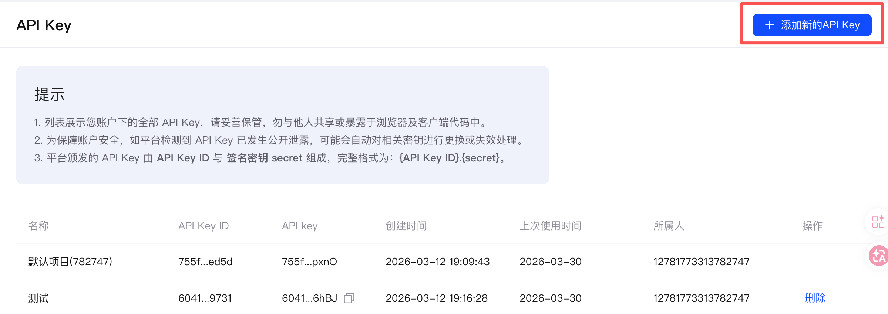

# claude code cli接入GLM免费模型

## 前言

ai浪潮下，各种agent已经ai ide层出不穷，当前最火的当书claude code(后文简称CC)。国内用户在使用CC时经常会遇到以下问题

1、因为不会使用梯子，导致无法使用cc服务

2、因为地区原因，经常封号

3、没有外币卡，无法注册账号或者订阅套餐

4、token费用无法承受

因此，我们需要一种更便捷，更经济的方式使用CC。经过一番研究，发现可以使用自定义大模型，而国内大模型中GLM系列模型有免费的模型可以直接使用。如果可以将CC和GLM结合的话，那么既可以降低使用门槛，同时在初期也可以节省一笔token费用

下面是CC使用GLM的详细步骤

## CC安装

### Mac用户

最简单的安装方式

```bash
brew install --cask claude-code 
```

### Linux用户

mac用户也可以使用这种方式安装

```bash
curl -fsSL https://claude.ai/install.sh | bash
```

### Windows 用户

```bash
curl -fsSL https://claude.ai/install.cmd -o install.cmd && install.cmd && del install.cmd
```

## GLM注册

### 账号注册

GLM本身可以免费注册使用，链接[https://www.bigmodel.cn/glm-coding?ic=TCSPU33KUB](https://www.bigmodel.cn/glm-coding?ic=TCSPU33KUB)

手机号即可注册

### API申请

地址：[https://bigmodel.cn/usercenter/proj-mgmt/apikeys](https://bigmodel.cn/usercenter/proj-mgmt/apikeys)

<figure><figcaption></figcaption></figure>

<figure><figcaption></figcaption></figure>

### CC配置

配置内容

```json
{
	"env": {
		"ANTHROPIC_AUTH_TOKEN": "<个人的apikey，在上一步可以直接复制>",
		"ANTHROPIC_BASE_URL": "https://open.bigmodel.cn/api/anthropic",
		"ANTHROPIC_DEFAULT_HAIKU_MODEL": "GLM-4.7-air",
		"ANTHROPIC_DEFAULT_SONNET_MODEL": "GLM-4.7",
		"ANTHROPIC_DEFAULT_OPUS_MODEL": "GLM-4.7"
	},
	"hasCompletedOnboarding": true
}
```

### Mac/Linux用户

文件路径：`~/.claude/settings.json`

### Windows用户

文件路径：\``` C:\Users\你的用户名\.claude\settings.json` ``

## 使用测试

打开命令行窗口

```
claude
```

<figure><figcaption></figcaption></figure>

选择yes

<figure><figcaption></figcaption></figure>

查看状态

```bash
/status
```

<figure><figcaption></figcaption></figure>

看到模型是GLM-4.7表示配置成功

如果使用过程中有问题，多半是apikey不对
