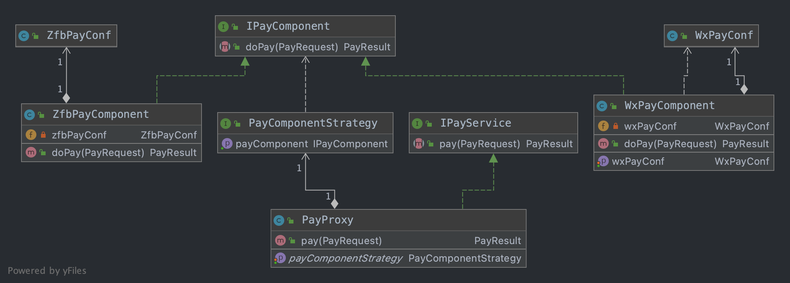

# Conditional实现bean按需加载

## 背景

公司有一些项目是对外的，同样的功能在不同的客户有不同的要求；比如A客户要求支付使用微信支付，B客户要求支付使用支付宝。诸如此类的诉求有很多，需要能根据客户的需求做一些定制化。目前针对此类需求主要是通过不同代码分支来控制；随着客户的增多，代码控制又是一个比较头疼的问题。因此希望寻找一种更便捷的方式来解决。

## 目标

通过技术实现一套代码应对不同客户的不同诉求。本文以支付为例

## 方案

针对上诉诉求，很容易想到代理模式和策略模式，具体UML参考如下

<figure><figcaption></figcaption></figure>

1、支付入口在IPayService(PayProxy)

2、实际支付逻辑在IPayComponent(WxPayComponent/ZfbPayComponent)

3、具体使用IPayComponent哪个实现有PayComponentStrategy控制

4、每个具体的PayComponent有自己的依赖和配置(WxPayConf/ZfbPayConf)

在实际交付过程中，如果PayComponent具体实现及其依赖实际上只需要实例化一个；例如如果使用微信支付，那么ZfbPayComponent和ZfbPayConf这两个bean是不需要的；那么如何做到这个呢？

在Spring boot中，我们通常在class上加上@Component或者@Configurationg或者@Service注解实现bean的自动加载，这里我们去掉这些注解这些bean就不会自动加载了；去掉之后如何按需加载呢？这里可以参考Springboot的提供的EanbleXxx注解，再搭配一个Configuration注解即可

```java
@Target(ElementType.TYPE)
@Retention(RetentionPolicy.RUNTIME)
@Import(WxPayConfiguration.class)
@Documented
public @interface EnableWxPay {
}

public class WxPayConfiguration {

    @Bean
    public WxPayConf wxPayConf() {
        return new WxPayConf();
    }

    @Bean("wxPayComponent")
    public IPayComponent wxPayComponent() {
        return new WxPayComponent();
    }
}
```

这样，在启动类上加上@EnableWxPay即可加载微信支付相关的bean了，同理可以制作一个@EnableZfbPay加载支付宝支付相关的bean了。到此问题基本解决

但是有个小小的点，通常来说，Controller我们不喜欢放到Configuration类中控制，有没有办法让Controller也实现按需加载呢，答案是有的，通过@Conditional系列注解来做，参考代码如下

```java
@Conditional(WxPayBeanCondition.class)
@Controller
public class WxPayController {
}
```

然后看WxPayBeanCondition实现

```java
public class WxPayBeanCondition implements Condition {
    
    private static Boolean result = null;

    @Override
    public boolean matches(ConditionContext context, AnnotatedTypeMetadata metadata) {
        // 缓存判断结果，多次调用直接返回缓存结果
        if (result == null) {
            result = doMatches(context.getBeanFactory());
        }
        log.info("match for {}, match={}", metadata, result);
        return result;
    }

    private boolean doMatches(ConfigurableListableBeanFactory factory) {
        // wxPayComponent 这个bean已经存在了，直接返回true，依赖wxPayComponent的bean可以加载
        if (factory.containsBean("wxPayComponent")) {
            return true;
        }

        String[] beanNames = factory.getBeanDefinitionNames();
        if (beanNames.length == 0) {
            return false;
        }

        for (String beanName : beanNames) {
            Class<?> clazz = factory.getType(beanName);
            // 应用已经开启了微信支付，依赖wxPayComponent的bean可以加载
            if (clazz.getAnnotation(EnableWxPay.class) != null) {
                return true;
            }
        }

        return false;
    }
}
```

可以看到condition的实现有判断分成2部分

1、factory.containsBean("wxPayComponent")

2、clazz.getAnnotation(EnableWxPay.class) != null

这是因为spring扫描的时候会优先扫描@Component(@Service,@Controller等)注解的class，如果是Configuration中定义的bean，在@Component注解表示的类被加载的时候，Configuration中定义的bean还没加载，此时走方式1判断会返回false，所以需要增加方式2
