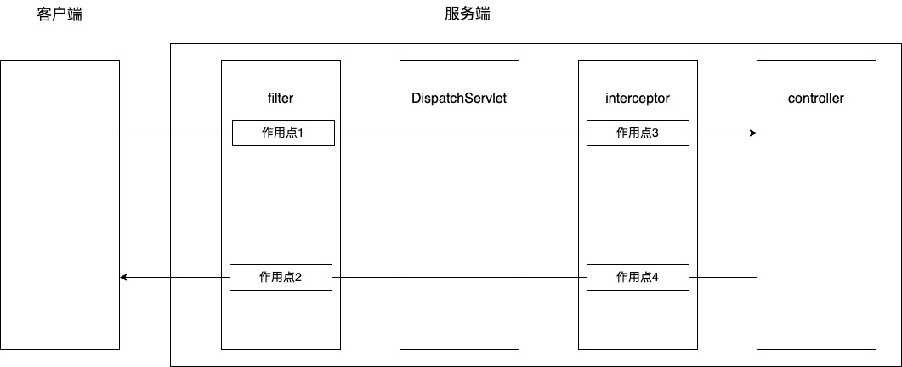

# java filter修改request内容和response内容

## 背景

最近在做一个开放平台，因为是对外开放的api，所以针对api做了签名和加密机制

请求阶段：原始request body 加密 -> encrypt body -> 签名，放到header

响应阶段：原始response body 加密 -> encrypt body -> 签名，放到header

## 方案

对于这种通用的http请求处理，最容易想到的就是通过java servlet filter或者spring mvc interceptor来做，具体原理可以参见下图

<figure><figcaption></figcaption></figure>

对于spring mvc interceptor，可以看下接口定义

因为需要针对request做签名验证和解密操作，因此需要对request和response做修改，springmvc中，request body和response body都是基于流(stream)来做的，但是stream只能读取一次；因此我们需要对request和response做一些处理

事实上，springmvc interceptor并不适合此场景，具体可以参考HandlerInterceptor接口定义

```java
public interface HandlerInterceptor {
    default boolean preHandle(HttpServletRequest request, HttpServletResponse response, Object handler) throws Exception {
        return true;
    }

    default void postHandle(HttpServletRequest request, HttpServletResponse response, Object handler, @Nullable ModelAndView modelAndView) throws Exception {
    }

    default void afterCompletion(HttpServletRequest request, HttpServletResponse response, Object handler, @Nullable Exception ex) throws Exception {
    }
}
```

此处修改request或者response并不会对后续的请求生效，因为HttpServletRequest，HttpServletResponse都未提供对流的修改操作

此时只能选择java servlet filter，我们看下filter接口定义

```java
public interface Filter {
    default void init(FilterConfig filterConfig) throws ServletException {
    }

    void doFilter(ServletRequest var1, ServletResponse var2, FilterChain var3) throws IOException, ServletException;

    default void destroy() {
    }
}
```

通常我们实现一个filter是流程如下

```java
public class XxxFilter implements Filter {
    @Override
    public void doFilter(ServletRequest request, ServletResponse response, FilterChain chain) throws IOException, ServletException {
        if (!condition) {
            // 错误处理
            // ...
        } else {
            // 继续往下，交给下一个
            chain.doFilter(request, response) 
        }
    }
}
```

事实上，我们依然无法修改request和reposne的stream对象，但是chain.doFilter时，我们可以传递一个和原始request, response不一样的对象

那么此处的filter流程如下

1、从header读取签名

2、从request读取request body，解密

3、校验签名，签名不通过，直接返回错误

4、构造新的request，request body内容是request body解密后的内容

5、构造新的response

6、根据新的request, resepond，通过chain.doFilter()继续往下执行

7、读取response body部分，并加密

8、生成签名，放入header

9、通过原始reponse，写入response body加密后的内容

整体框架代码如下

```java
public class ApiSignFilter implements Filter {

    @Override
    public void init(FilterConfig filterConfig) throws ServletException {
    }

    @Override
    public void doFilter(ServletRequest request, ServletResponse response, FilterChain chain) throws IOException, ServletException {

        HttpServletRequest httpServletRequest = (HttpServletRequest) request;

        // 读取header内容，app_key，签名等内容
        String appKey = httpServletRequest.getHeader(APP_KEY);
        String sign = httpServletRequest.getHeader(AUTHORIZATION_KEY);
        String nonceStr = httpServletRequest.getHeader(NONCE_STR_KEY);
        String timestamp = httpServletRequest.getHeader(TIMESTAMP_KEY);
        
        // 缺少header，直接返回错误
        if (StringUtils.isBlank(appKey) || StringUtils.isBlank(sign)) {
            noOkResp((HttpServletResponse) response, HttpStatus.UNAUTHORIZED);
            return;
        }

        // 读取body
        String body = null;
        if (httpServletRequest.getContentLength() > 0) {
            body = new String(IOUtils.toByteArray(httpServletRequest.getInputStream()), request.getCharacterEncoding());
        }
        // 根据规则生成签名
        String verifySign = generateSign(httpServletRequest.getRequestURL().toString(), body, nonceStr, timestamp);
        // 校验签名，校验失败直接返回
        if (!StringUtils.equals(sign, verifySign)) {
            noOkResp((HttpServletResponse) response, HttpStatus.UNAUTHORIZED);
            return;
        }

        // 解密request body 
        String postRequestBody = null;
        if (StringUtils.isNotBlank(body)) {
            JSONObject bodyMap = JSON.parseObject(body);
            postRequestBody = clientHelper.decryptBody((String) bodyMap.get(ENCRYPT_BODY_KEY));
        }

        // 构造新的request和response，继续执行请求
        AuthHttpServletRequestWrapper requestWrapper = new AuthHttpServletRequestWrapper(httpServletRequest, postRequestBody);
        AuthHttpServletResponseWrapper responseWrapper = new AuthHttpServletResponseWrapper((HttpServletResponse) response);
        chain.doFilter(requestWrapper, responseWrapper);

        // 请求失败处理
        if (responseWrapper.getStatus() != HttpStatus.OK.value()) {
            response.getOutputStream().write(responseWrapper.getResponseData());
            response.getOutputStream().flush();
            return;
        }

        // 读取body并加密
        String respBody = new String(responseWrapper.getResponseData(), responseWrapper.getCharacterEncoding());
        String encryptRespBody = clientHelper.encryptBody(respBody);

        Map<String, String> encryptBodyMap = new HashMap<>();
        encryptBodyMap.put(ENCRYPT_BODY_KEY, encryptRespBody);
        String postBody = JSON.toJSONString(encryptBodyMap);

        // 生成签名并写入header
        nonceStr = UUID.randomUUID().toString();
        long respTs = System.currentTimeMillis();
        String responseSign = generateSign(requestWrapper.getRequestURL().toString(), postBody, nonceStr, respTs);
        ((HttpServletResponse) response).addHeader(NONCE_STR_KEY, nonceStr);
        ((HttpServletResponse) response).addHeader(TIMESTAMP_KEY, String.valueOf(respTs));
        ((HttpServletResponse) response).addHeader(AUTHORIZATION_KEY, responseSign);
        
        // 写入加密后的reseponse body
        response.getWriter().write(postBody);
        response.getWriter().flush();
    }

```

具体的RequestWrapper，ResponseWrapper代码如下

```java
public class AuthHttpServletRequestWrapper extends HttpServletRequestWrapper {
    /// 这里缓存了body
    private byte[] body;

    public AuthHttpServletRequestWrapper(HttpServletRequest request, String data) {
        super(request);
        body = data == null ? new byte[0] : data.getBytes(StandardCharsets.UTF_8);
    }

    // 这里保证了stream可以多次读取
    @Override
    public ServletInputStream getInputStream() {
        return new RRServletInputStreamWrapper(body);
    }

    @Override
    public BufferedReader getReader() {
        return new BufferedReader(new InputStreamReader(this.getInputStream()));
    }
}

public class RRServletInputStreamWrapper extends ServletInputStream {

    private InputStream inputStream;

    public RRServletInputStreamWrapper(byte[] data) {
        super();
        this.inputStream = new ByteArrayInputStream(data);
    }

    @Override
    public boolean isFinished() {
        return false;
    }

    @Override
    public boolean isReady() {
        return true;
    }

    @Override
    public void setReadListener(ReadListener readListener) {

    }

    @Override
    public int read() throws IOException {
        return this.inputStream.read();
    }
}
```

```java
public class AuthHttpServletResponseWrapper extends HttpServletResponseWrapper {

    private ByteArrayOutputStream buffer;
    private ServletOutputStream outputStream;
    private PrintWriter writer;

    public AuthHttpServletResponseWrapper(HttpServletResponse response) throws UnsupportedEncodingException {
        super(response);

        this.buffer = new ByteArrayOutputStream();
        // 这里不是原始response可以拿到的outputStream，这里做了缓存，因此写入不会影响到response
        this.outputStream = new BufferedServletOutputStreamWrapper(buffer);
        this.writer = new PrintWriter(new OutputStreamWriter(buffer, this.getCharacterEncoding()));
    }


    @Override
    public ServletOutputStream getOutputStream() throws IOException {
        return this.outputStream;
    }

    @Override
    public PrintWriter getWriter() throws IOException {
        return this.writer;
    }

    @Override
    public void flushBuffer() throws IOException {
        if (outputStream != null) {
            outputStream.flush();
        }
        if (writer != null) {
            writer.flush();
        }
    }

    @Override
    public void reset() {
        buffer.reset();
    }

    public byte[] getResponseData() throws IOException {
        flushBuffer();
        return buffer.toByteArray();
    }
}

public class BufferedServletOutputStreamWrapper extends ServletOutputStream {

    private OutputStream outputStream;

    public BufferedServletOutputStreamWrapper(OutputStream outputStream) {
        super();
        this.outputStream = outputStream;
    }

    @Override
    public boolean isReady() {
        return true;
    }

    @Override
    public void setWriteListener(WriteListener writeListener) {

    }

    @Override
    public void write(int b) throws IOException {
        this.outputStream.write(b);
    }

    @Override
    public void write(byte[] b) throws IOException {
        super.write(b, 0, b.length);
    }
}

```
