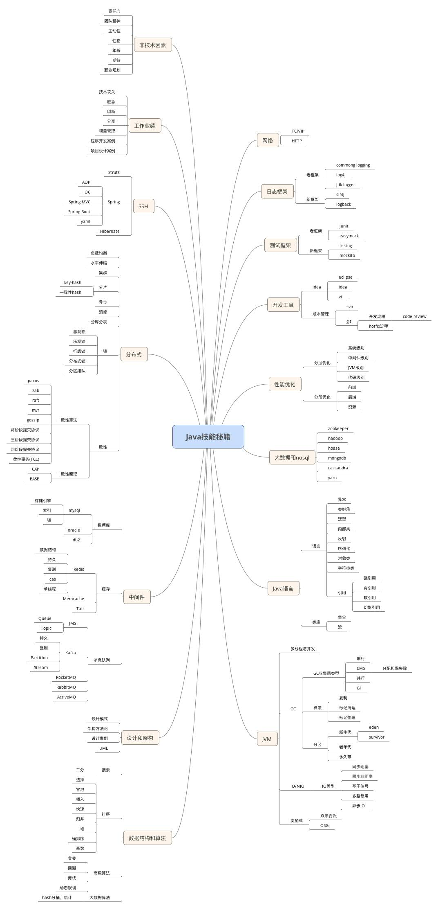
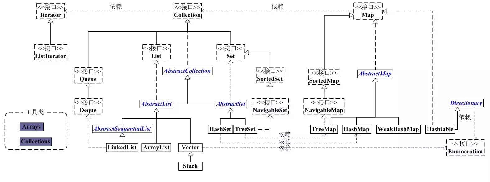
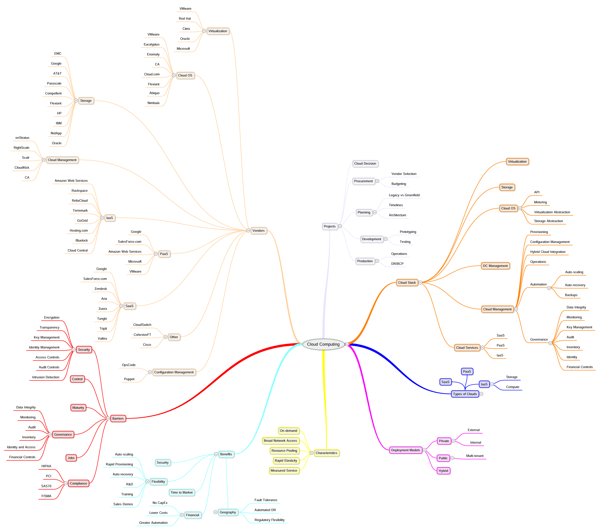
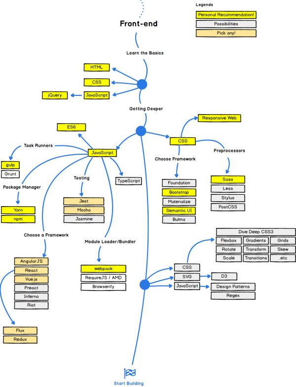

# 架构师图谱

## 1.1架构师图谱

<figure><figcaption></figcaption></figure>

## 1.2Java架构师图谱

<figure><figcaption></figcaption></figure>

## 1.3微服务架构秘籍

<figure><figcaption></figcaption></figure>

## 1.4一致性图谱

<figure><figcaption></figcaption></figure>

## 1.5互联网大流量的方法

<figure><figcaption></figcaption></figure>

## 1.6安全秘籍

<figure><figcaption></figcaption></figure>

## 1.7阿里巴巴常用小框架

<figure><figcaption></figcaption></figure>

## 1.8架构方法论图谱

<figure><figcaption></figcaption></figure>

## 1.9设计模式秘籍图谱

<figure><figcaption></figcaption></figure>

## 2.1JVM垃圾回图谱

<figure><figcaption></figcaption></figure>

## 2.2Java并发图谱

<figure><figcaption></figcaption></figure>

## 2.3Java集合图谱

<figure><figcaption></figcaption></figure>

## 2.4Java集合类图

<figure><figcaption></figcaption></figure>

## 3.1Hadoop技能图谱

<figure><figcaption></figcaption></figure>

## 3.2大数据技能图谱

<figure><figcaption></figcaption></figure>

## 4.1云计算图谱

<figure><figcaption></figcaption></figure>

## 4.2云计算技能图谱

<figure><figcaption></figcaption></figure>

## 5.1IOS技能图谱

<figure><figcaption></figcaption></figure>

## 5.2OpenResty技能图谱

<figure><figcaption></figcaption></figure>

## 5.3前端技能图谱

<figure><figcaption></figcaption></figure>

## 5.4容器技能图谱

<figure><figcaption></figcaption></figure>

## 5.5嵌入式开发技能图谱

<figure><figcaption></figcaption></figure>

## 5.6开发语言宝典

<figure><figcaption></figcaption></figure>

## 5.7移动端测试图谱

<figure><figcaption></figcaption></figure>

## 5.8运维技能图谱

<figure><figcaption></figcaption></figure>

## 5.9软件工程

<figure><figcaption></figcaption></figure>

## 5.10DevOps

<figure><figcaption></figcaption></figure>

## 5.11前端开发

<figure><figcaption></figcaption></figure>

## 5.12后端开发

<figure><figcaption></figcaption></figure>

## 5.13软件发布流程

<figure><figcaption></figcaption></figure>
