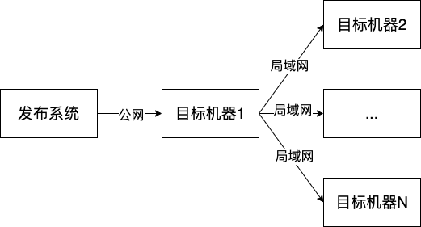

# 阿里云部署-文件传输优化

## 背景

最近项目上到阿里云之后，发现部署特别慢，其中大部分耗时都消耗在文件传输上

## 目标

优化文件传输规则，降低文件传输耗时

## 方案

### 现状

当前发布系统部署在公司专有网络，发布系统传输文件到目标机器（阿里云）需要走公网传输，大致效果如下

<figure><figcaption></figcaption></figure>

所有机器都需要发布系统走公网传输文件，这里是非常浪费的，因此很容易想到的方案是

发布系统先发布文件到一台目标机器1，其他目标机器通过目标机器1走局域网传输，效果如下

<figure><figcaption></figcaption></figure>

对应修改如下

```groovy
// 前端
__Deploy_SWITCH_IP = "<目标机器1外网ip>"
__Deploy_SWITCH_INNER_IP = "<目标机器1局域网ip>"

if (__Deploy_IP.contains("192.168")) {
	// 公司内网直接scp
	sh "scp -P ${__Deploy_SSH_Port} -r dist/* ${__Deploy_Account}@${__Deploy_IP}:${__Deploy_Version}"
} else if (__Deploy_IP == __Deploy_SWITCH_IP) {
	// 阿里云中继节点rsync增量同步
	// todo
} else {
	// 阿里云其他节点，从中继节点同步
	sh """ssh -p ${__Deploy_SSH_Port} ${__Deploy_Account}@${__Deploy_IP} "scp -r -P ${__Deploy_SSH_Port} root@${__Deploy_SWITCH_INNER_IP}:${__Deploy_Version}/* ${__Deploy_Version}" """
}
```

```groovy
// 后端
__Deploy_SWITCH_IP = "<目标机器1外网ip>"
__Deploy_SWITCH_INNER_IP = "<目标机器1局域网ip>"

if (__Deploy_IP.contains("192.168")) {
	// 公司内网直接scp
	sh "scp -P ${__Deploy_SSH_Port} ${server_name}-${TAG}.jar ${__Deploy_Account}@${__Deploy_IP}:${__Deploy_Dir}"
} else if (__Deploy_IP == __Deploy_SWITCH_IP) {
	// 阿里云中继结点，解压jar包rsync增量复制后重新生成jar包
	// todo
} else {
	// 阿里云其他节点，从中继节点scp
	sh """ssh -p ${__Deploy_SSH_Port} ${__Deploy_Account}@${__Deploy_IP} "scp -P ${__Deploy_SSH_Port} root@${__Deploy_SWITCH_INNER_IP}:${__Deploy_Dir}/${server_name}-${TAG}.jar ${__Deploy_Dir}" """
}							   
```

此时问题解决大半，是否还可以继续优化呢？

我们可以发现，现在从发布系统到目标机器1每次传输都是全量文件传输，实际上每次发布，变更的文件总是很小一部分，这里能否只传输需要变动的文件呢？答案是可以的，实现文件增量传输即可

#### 文件增量传输

文件增量传输需要前端和后端分开来看

前端：发布的是一个个的静态文件(html/js/css/图片/字体等）

后端：每次发布的是一个jar包（基于spring boot)

因此前端相对好说，直接使用rsync命令做增量传输即可，修改如下

```groovy
else if (__Deploy_IP == __Deploy_SWITCH_IP) {
	// 阿里云中继节点，rsync增量同步
	
	// 目标机器同步线上版本到目标目录
	sh """ssh -p ${__Deploy_SSH_Port} ${__Deploy_Account}@${__Deploy_IP} "[ ! -d ${__Deploy_Dir} ] || cp -r ${__Deploy_Dir}/* ${__Deploy_Version} || echo 1 > /dev/null" """
	// ssh通道rsync增量传输文件
	sh """rsync -e "ssh -p ${__Deploy_SSH_Port}" -avl --delete dist/ ${__Deploy_Account}@${__Deploy_IP}:${__Deploy_Version}"""
}
```

后端传输的是jar包，还能做增量传输吗？做增量传输是否还有意义？

先说结论，可以做，且意义重大

实际上jar包是一个压缩包，spring boot打出来的jar是一个fat jar，由一个个的class文件，resource文件以及依赖的各种三方包的jar组成，我们可以通过jar命令解压看一下，这里不做详细解释，命令如下

```bash
jar -xvf xxx.jar
```

通过实际分析发现，jar中比较大的都是一些依赖的三方包；在项目迭代过程中，除了少部分时候需要更新三方包的版本或者引入了新的三方包外，大部分时候依赖的三方包比较稳定，也就是说大部分时候变动的只是项目内的代码编译成的class文件以及一些resource文件，这部分文件占用的大小非常小。

通过上面的分析，如果能实现增量文件传输，大部分时候我们只需要传输一个class文件和resource文件，少部分时候需要传输一些版本变动的三方包和新引入的三方包，做增量传输是非常划算的

如何实现jar包的增量传输呢？步骤大致如下

* 在发布系统生成最新的jar包
* 在发布系统解压最新的jar包
* 增量传输变动的class文件、resource文件、三方jar到目标机器
* 在目标机器重新生成jar即可

以上步骤只需要少数命令即可完成，此处忽略发布系统生成jar的过程，只给出2-4步过程，大致如下

```groovy
else if (__Deploy_IP == __Deploy_SWITCH_IP) {
	// 阿里云中继结点，解压jar包rsync增量复制后重新生成jar包
	
	// 防止污染，先删除目录
	sh "[ ! -d ${server_name}-${TAG} ] || rm -rf ${server_name}-${TAG}" 
	// 创建目录，将最新jar拷贝到目录
	sh "mkdir ${server_name}-${TAG} && cp ${server_name}-${TAG}.jar ${server_name}-${TAG}/"
	// 解压最新jar
	sh "cd ${server_name}-${TAG} && jar -xvf ${server_name}-${TAG}.jar && rm -rf ${server_name}-${TAG}.jar && cd .."
	
	// 目标机器上创建对应目录（首次发布时没有对应目录）
	sh """ssh -p ${__Deploy_SSH_Port} ${__Deploy_Account}@${__Deploy_IP} "[ -d ${__Deploy_Dir}/${server_name} ] || mkdir -p ${__Deploy_Dir}/${server_name}" """
	// ssh通道rsync增量传输文件
	sh """rsync -e "ssh -p ${__Deploy_SSH_Port}" -avl --delete  ${server_name}-${TAG}/  ${__Deploy_Account}@${__Deploy_IP}:${__Deploy_Dir}/${server_name}"""
	// 目标机器jar名称生成最新jar包
	sh """ssh -p ${__Deploy_SSH_Port} ${__Deploy_Account}@${__Deploy_IP} "cd ${__Deploy_Dir}/${server_name} && jar cvfm0 ../${server_name}-${TAG}.jar META-INF/MANIFEST.MF ./" """
	// 传输完成之后清理工作
	sh "[ ! -d ${server_name}-${TAG} ] || rm -rf ${server_name}-${TAG}"
}

```
