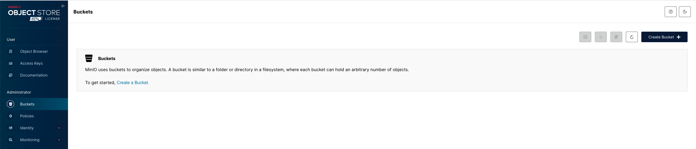
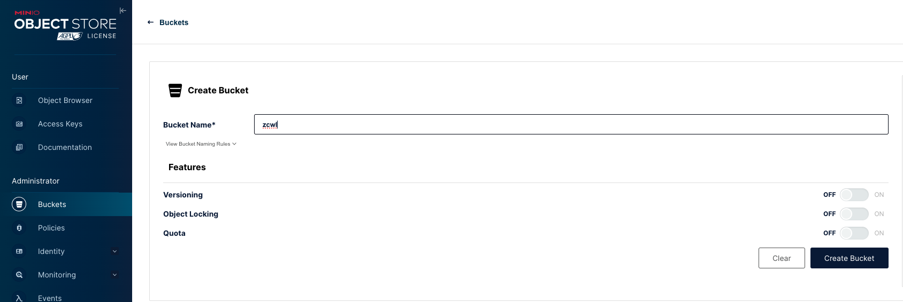
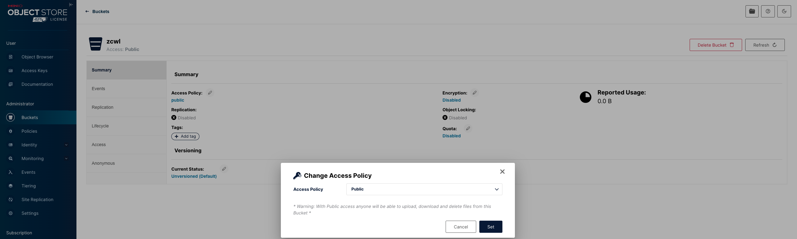
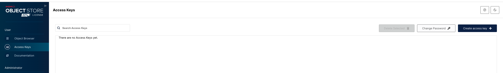
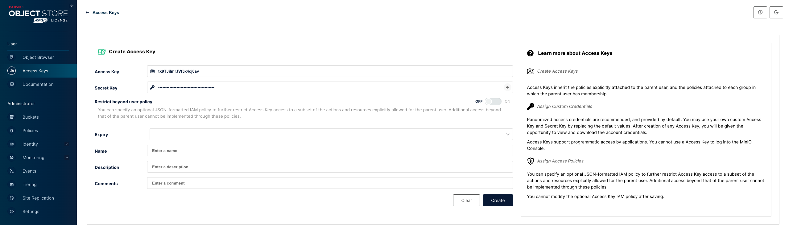

# minio实现文件存储

## &#x20;背景

当前项目中，文件存储使用的是本地磁盘；整体状况如下

* 上传时：后端直接将文件写到本地磁盘
* 下载时：通过springboot 提供的静态目录映射完成

当前的设计在分布式场景下会有问题，加入文件服务有多个实例，在多个实例场景下将文件写到一个统一的本地磁盘是比较麻烦的

## 目标

实现文件的分布式存储

## 方案

目前主流的文件存储方案大致如下

| 方案   | 详情                 | 优点          | 缺点              |
| ---- | ------------------ | ----------- | --------------- |
| 三方存储 | 1、各种oss，比如aws，tfs等 | 用户量大，专业团队维护 | 付费              |
| 自建   | 1、fastdfs，minio等   | 免费          | 维护成本，问题快速解决能力不足 |

公司出于成本考虑，决定使用自建的方式，结合开源热度和维护团队情况，最终选择使用minio作为实现

这里使用docker作为演示

## 实施步骤

* 镜像拉取

```bash
 docker pull bitnami/minio:2023
```

* 新建本地磁盘映射

```bash
mkdir -p /opt/data/minio
chown 1001:1001 /opt/data/minio # minio默认用户1001
```

* 启动

注意，登录用户名最小长度5位，密码最小长度8位

```bash
 docker run -d --name minio --restart always -p 9000:9000 -p 9001:9001 -v /opt/data/minio:/bitnami/minio/data --env="MINIO_ROOT_USER=控制台登录用户名" --env="MINIO_ROOT_PASSWORD=控制台登录密码" --privileged=true bitnami/minio:2023
```

* 防火墙开放端口

```bash
firewall-cmd --zone=public --add-port=9000/tcp --permanent
firewall-cmd --zone=public --add-port=9001/tcp --permanent
firewall-cmd --list-all
```

* 初始化

浏览器窗口打开，地址http://\<ip>:9000，登录使用刚才启动时设置的密码

<figure><figcaption></figcaption></figure>

* 创建bucket

<figure><figcaption></figcaption></figure>

<figure><figcaption></figcaption></figure>

<figure><figcaption></figcaption></figure>

* 创建access keys

<figure><figcaption></figcaption></figure>

<figure><figcaption></figcaption></figure>

## 历史数据导入

* mc客户端安装

```bash
curl https://dl.min.io/client/mc/release/linux-amd64/mc \
  --create-dirs \
  -o $HOME/minio-binaries/mc

chmod +x $HOME/minio-binaries/mc
export PATH=$PATH:$HOME/minio-binaries/

mc --help
```

* 添加别名

```bash
mc alias set <别名>  http://<ip>:9000 <access_key> <secret_key>
```

* 历史数据导入

```
mc cp -r <本地文件存储根目录>  <别名>/<bucket>
```

## imgproxy兼容

上文提到，使用imgproxy做缩略图片的处理，imgproxy在做缩略图时会从本地获取图片，现在改成minio之后原有的方式也需要做调整

幸运的是，imgproxy支持s3协议，其中minio也支持s3协议，所以问题不大

imgproxy启动方式需要增加s3相关配置

```bash
docker run -d --name imgproxy --restart always -p 9999:8080 -v /opt/data/backend/file:/app/images --env="IMGPROXY_LOCAL_FILESYSTEM_ROOT=/app/images" --env="IMGPROXY_S3_ENDPOINT=http://<ip>:9000" --env="IMGPROXY_USE_S3=true" --env="AWS_ACCESS_KEY_ID=<access_key>" --env="AWS_SECRET_ACCESS_KEY=<secret_key>" --user root --privileged darthsim/imgproxy 
```

说明

| 变量                       | 说明                              |
| ------------------------ | ------------------------------- |
| IMGPROXY\_USE\_S3        | true，支持s3                       |
| IMGPROXY\_S3\_ENDPOINT   | s3 代理链接，此处为http://\<ip>:9000    |
| AWS\_ACCESS\_KEY\_ID     | s3 access\_key，上文创建的access\_key |
| AWS\_SECRET\_ACCESS\_KEY | s3 secret\_key，上文创建的secret\_key |

对应nginx中，转发到imgproxy的地方修改成

```
rewrite ^(.*)$ /signature/resize:$arg_f:$arg_w:$arg_h:0/plain/s3://<bucket>/$encoded_filename@$arg_t break;
```

对应nginx中，直接通过http请求的地方可以改成直连minio

```
rewrite ^/api/infrastructure/static/file/(.*)$ /<bucket>/$1 break;
# 没有携带参数p则直接请求原图 10001为后端服务的路径
proxy_pass http://<ip>:9000;
```

## 程序修改

需要将静态文件目录映射修改成http://\<ip>:9000/\<bucket>


## nginx代理minio

```
server {
    listen 80;
    server_name <servername>;
    return  301 https://$server_name$request_uri;
}

server {
        server_name <servername>;
        access_log /opt/data/nginx/logs/<servername>_access.log json;
        error_log /opt/data/nginx/logs/<servername>_error.log;

        listen 443 ssl; # managed by Certbot
        ssl_certificate /etc/letsencrypt/live/<domain>/fullchain.pem; # managed by Certbot
        ssl_certificate_key /etc/letsencrypt/live/<domain>/privkey.pem; # managed by Certbot
        include /etc/letsencrypt/options-ssl-nginx.conf; # managed by Certbot
        ssl_dhparam /etc/letsencrypt/ssl-dhparams.pem; # managed by Certbot


        ignore_invalid_headers off;
        # Allow any size file to be uploaded.
        # Set to a value such as 1000m; to restrict file size to a specific value
        client_max_body_size 0;
        # Disable buffering
        proxy_buffering off;
        proxy_request_buffering off;

        location / {
                proxy_set_header Host $http_host;
                proxy_set_header X-Real-IP $remote_addr;
                proxy_set_header X-Forwarded-For $proxy_add_x_forwarded_for;
                proxy_set_header X-Forwarded-Proto $scheme;

                proxy_connect_timeout 300;
                # Default is HTTP/1, keepalive is only enabled in HTTP/1.1
                proxy_http_version 1.1;
                proxy_set_header Connection "";
                chunked_transfer_encoding off;

                proxy_pass http://<ip>:9001; # This uses the upstream directive definition to load balance
        }

        location /ws {
                
                proxy_set_header Host $http_host;
                proxy_set_header X-Real-IP $remote_addr;
                proxy_set_header X-Forwarded-For $proxy_add_x_forwarded_for;
                proxy_set_header X-Forwarded-Proto $scheme;
                proxy_set_header X-NginX-Proxy true;

                # This is necessary to pass the correct IP to be hashed
                real_ip_header X-Real-IP;

                proxy_connect_timeout 300;

                # To support websockets in MinIO versions released after January 2023
                proxy_http_version 1.1;
                proxy_set_header Upgrade $http_upgrade;
                proxy_set_header Connection "upgrade";
                # Some environments may encounter CORS errors (Kubernetes + Nginx Ingress)
                # Uncomment the following line to set the Origin request to an empty string
                # proxy_set_header Origin '';

                chunked_transfer_encoding off;

                proxy_pass http://<ip>/ws; # This uses the upstream directive definition to load balance
        }
}
```
