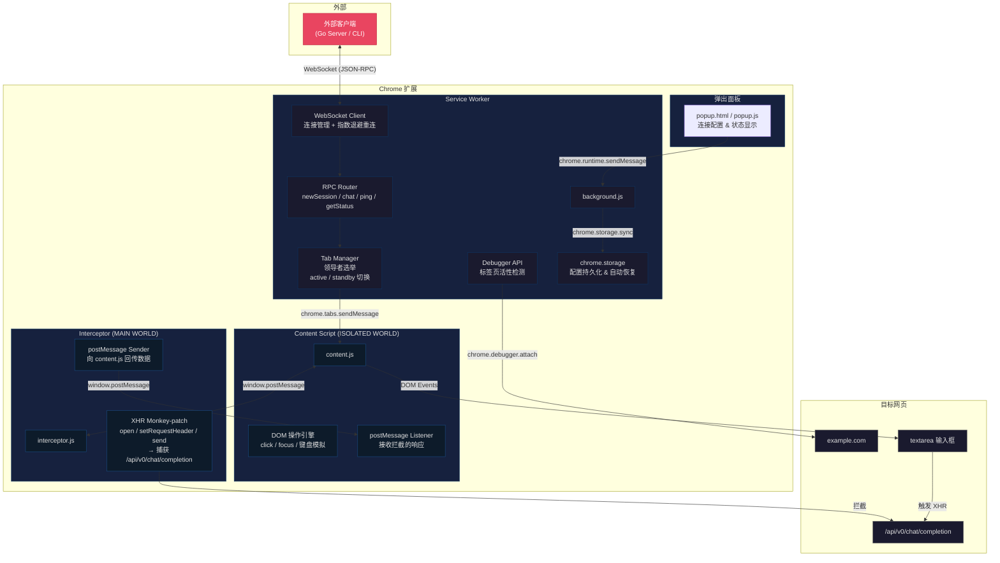
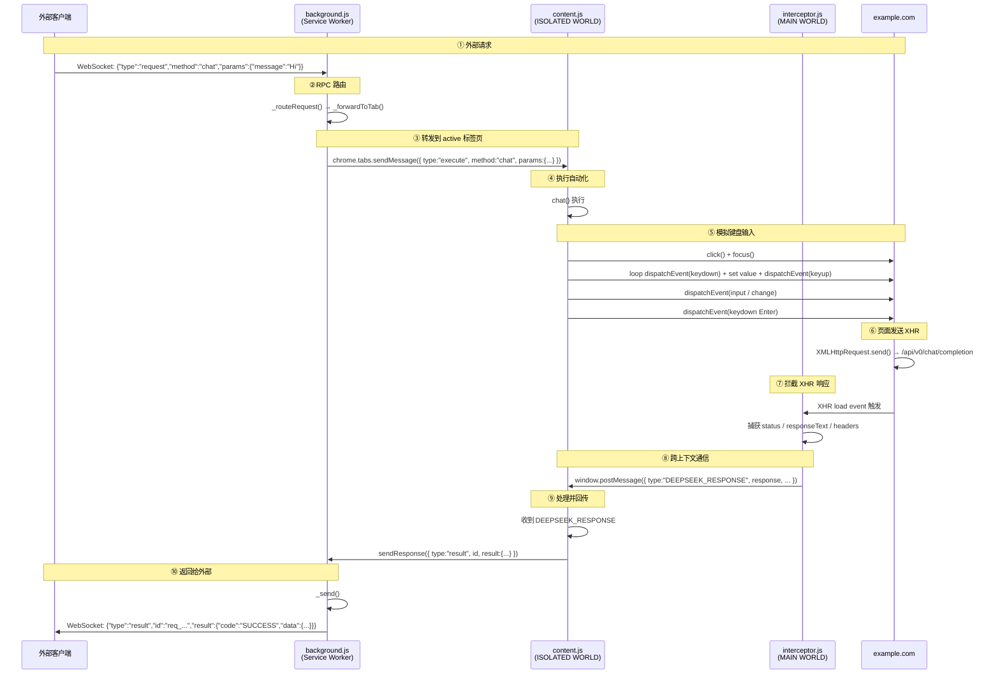

# Chrome 扩展还能这样玩？ 12 个技术细节把网页改造成 API 接口

> 本文以 **ds-chat2api Data Collector** Chrome 扩展为例，深度拆解一个将网页包装成 API 的扩展中使用了哪些关键技术。适合对 Chrome 扩展开发、浏览器自动化、WebSocket 通信感兴趣的开发者阅读。

## 背景

`ds-chat2api` 是一个 Chrome 扩展，它的目标非常明确：**把 目标网页（example.com）通过 WebSocket 协议暴露成一个可远程调用的 API**。

听起来很酷？让我们来看看它是怎么做到的。

## 技术总览

| #  | 技术                           | 文件                                | 作用                        |
| -- | ---------------------------- | --------------------------------- | ------------------------- |
| 1  | Manifest V3 + Service Worker | `manifest.json`, `background.js`  | 构建现代 Chrome 扩展的基座         |
| 2  | WebSocket 客户端 + 指数退避重连       | `background.js`                   | 与外部服务保持长连接                |
| 3  | 多 Tab 领导者选举                  | `background.js`                   | 在多个 目标标签页中自动选出一个 active 页 |
| 4  | Chrome Debugger API          | `background.js`                   | 附加到标签页的调试器                |
| 5  | Content Script 注入            | `manifest.json`, `content.js`     | 向目标页面注入自动化逻辑              |
| 6  | MAIN 世界脚本注入                  | `background.js`, `interceptor.js` | 注入到页面主世界，拦截原生 API         |
| 7  | XHR 猴子补丁 (Monkey-patching)   | `interceptor.js`                  | 拦截 XMLHttpRequest 请求与响应   |
| 8  | 键盘事件模拟                       | `content.js`                      | 程序化模拟用户在输入框打字             |
| 9  | window.postMessage 跨上下文通信    | `content.js`, `interceptor.js`    | 主世界脚本与内容脚本交换数据            |
| 10 | RPC 风格消息协议                   | `background.js`                   | 通过 JSON 消息实现远程过程调用        |
| 11 | 心跳保活机制                       | `background.js`                   | 检测 WebSocket 连接健康状态       |
| 12 | chrome.storage 持久化           | `background.js`, `popup.js`       | 保存用户配置和连接状态               |

下面逐一深入。

## 技术一：Manifest V3 + Service Worker

```json
{
  "manifest_version": 3,
  "name": "ds-chat2api Data Collector",
  "background": {
    "service_worker": "background.js",
    "type": "module"
  },
  "permissions": ["debugger", "storage", "tabs", "scripting"],
  "host_permissions": ["https://example.com/*"]
}
```

**作用**：Manifest V3 是 Chrome 扩展的最新标准，最大变化是**用 Service Worker 替代了原来的 Background Page**。Service Worker 是一个独立于浏览器 UI 线程的后台脚本，在不需要时会被 Chrome 休眠以节省资源。

**关键点**：

* `service_worker`：声明后台脚本，`type: "module"` 表示支持 ES Module。
* `permissions`：声明需要的权限——`debugger`（调试器）、`storage`（存储）、`tabs`（标签页）、`scripting`（脚本注入）。
* `host_permissions`：限定扩展只在 `example.com` 域名下生效，增强安全性。

## 技术二：WebSocket 客户端 + 指数退避重连

```javascript
// background.js — WebSocket 客户端核心
const ws = {
  socket: null,
  connected: false,

  _doConnect() {
    const url = this.wsUrl || `ws://localhost:${this.port}`;
    this.socket = new WebSocket(url);

    this.socket.onopen = () => {
      this.connected = true;
      reconnectAttempt = 0;
      this._startHeartbeat();
    };

    this.socket.onclose = () => {
      this.connected = false;
      this.socket = null;
      this._scheduleReconnect();  // 断开后自动重连
    };
  },

  _scheduleReconnect() {
    // 指数退避：1s → 2s → 4s → 8s → ... → 最大 30s
    const delay = Math.min(
      RECONNECT_BASE_MS * Math.pow(2, reconnectAttempt),
      RECONNECT_MAX_MS,
    );
    reconnectAttempt++;
    setTimeout(() => ws._doConnect(), delay);
  },
};
```

**作用**：建立一个持久的 WebSocket 连接，让外部服务可以随时向浏览器发送指令。

**核心设计**：

* `_doConnect()` 负责实际建立连接。
* `_scheduleReconnect()` 使用\*\*指数退避（Exponential Backoff）\*\*策略：第一次重等 1 秒，第二次 2 秒，第三次 4 秒……最大 30 秒。这种策略在网络不稳定时避免频繁重连造成的资源浪费。
* 连接成功后 `reconnectAttempt` 归零，下次断开重新从 1s 开始。

## 技术三：多 Tab 领导者选举

```javascript
// background.js — Tab 管理器
let tabStates = new Map();   // tabId → "active" | "standby"
let activeTabId = null;

function handleTabAvailable(tabId, tab) {
  if (activeTabId === null) {
    // 没有 active 标签 → 提升为 leader
    tabStates.set(tabId, "active");
    activeTabId = tabId;
    attachDebuggerToActive();
  } else {
    // 已有 active 标签 → 设为 standby
    tabStates.set(tabId, "standby");
  }
}

function handleTabRemoved(tabId) {
  if (tabId === activeTabId) {
    // Leader 被关闭 → 从 standby 中选一个接替
    activeTabId = null;
    promoteNextTab();
  }
}

function promoteNextTab() {
  const standbyTabs = [];
  for (const [tabId, state] of tabStates.entries()) {
    if (state === "standby") standbyTabs.push(tabId);
  }
  if (standbyTabs.length === 0) return;

  const nextTabId = standbyTabs[0];
  tabStates.set(nextTabId, "active");
  activeTabId = nextTabId;
  attachDebuggerToActive();
}
```

**作用**：用户可能打开多个 目标标签页，扩展需要决定**把指令发送给哪个标签页**。这里实现了一个简单的领导者选举算法：

1. 第一个打开的标签页成为 **active（领导者）**。
2. 后续打开的标签页进入 **standby（候补）** 队列。
3. active 标签关闭时，自动从 standby 中**按 FIFO 顺序**晋升一个为 active。
4. 所有 RPC 请求都转发给当前 active 标签页。

这保证了在任何时刻，系统只有一个"干活"的标签页，避免了状态冲突。

## 技术四：Chrome Debugger API

```javascript
function attachDebuggerToActive() {
  if (activeTabId === null) return;

  const debuggee = { tabId: activeTabId };
  chrome.debugger.attach(debuggee, "1.3", () => {
    if (chrome.runtime.lastError) {
      if (chrome.runtime.lastError.message.includes("already attached")) return;
      // 附加失败 → 换一个 tab
      activeTabId = null;
      promoteNextTab();
      return;
    }
  });
}
```

**作用**：Chrome Debugger API 允许扩展像 Chrome DevTools 一样**附加调试器到标签页**。虽然这个扩展主要功能并不依赖 Debugger（核心是 XHR 拦截），但 Debugger 的附加在这里充当了**标签页的活性检测**和备用的网络请求捕获通道。

**注意**：`"1.3"` 是调试器协议版本号。如果标签页已经打开了 DevTools，附加会失败，扩展会自动切换到另一个标签页。

## 技术五：Content Script 注入

```json
{
  "content_scripts": [
    {
      "matches": ["https://example.com/*"],
      "js": ["content.js"],
      "run_at": "document_start"
    }
  ]
}
```

**作用**：Content Script（内容脚本）是注入到网页中的 JavaScript，但**运行在一个隔离的 "ISOLATED WORLD" 中**。它不能访问页面自身的 JS 变量，但可以操作 DOM 和调用有限的 Chrome API。

**关键点**：

* `matches`：限定仅在 `example.com` 下执行。
* `run_at: "document_start"`：在页面加载的最早期注入，确保尽早准备好监听器。

`content.js` 是整个扩展的**自动化执行引擎**，负责：

* 接收 background 发来的 RPC 指令
* 操作 DOM（点击按钮、填写输入框）
* 通过 `window.postMessage` 与 interceptor.js 通信

## 技术六：MAIN 世界脚本注入

```javascript
// background.js — 动态注册 MAIN 世界脚本
chrome.scripting.registerContentScripts([
  {
    id: "deepseek-interceptor",
    matches: ["https://example.com/*"],
    js: ["interceptor.js"],
    world: "MAIN",            // ← 关键：注入到主世界
    runAt: "document_start",  // ← 尽早注入
  },
]);
```

**作用**：这是 Chrome 扩展中一个高级技巧。普通的 content script 运行在 **ISOLATED WORLD**，无法访问页面自身的 JavaScript 变量。而 `world: "MAIN"` 让脚本**直接注入到网页的主执行环境**中。

为什么需要这样做？因为我们要**覆盖页面的原生 `XMLHttpRequest`**。这个覆盖必须在页面自己的 JS 代码执行之前完成，否则页面的 XHR 请求已经发出去，我们就拦截不到了。

**注入时机**：`runAt: "document_start"` + `world: "MAIN"` = 在页面任何脚本执行之前完成拦截器的安装。


`world: "MAIN"` 注入的脚本不能使用 `chrome.*` API，因此与 content script 的通信只能通过 `window.postMessage` 进行。


## 技术七：XHR 猴子补丁 (Monkey-patching)

```javascript
// interceptor.js — 拦截 XMLHttpRequest
const originalXHROpen = XMLHttpRequest.prototype.open;
XMLHttpRequest.prototype.open = function (method, url) {
  this._interceptUrl = url;
  this._interceptMethod = method;
  return originalXHROpen.apply(this, arguments);
};

const originalSetRequestHeader = XMLHttpRequest.prototype.setRequestHeader;
XMLHttpRequest.prototype.setRequestHeader = function (name, value) {
  if (!this._interceptRequestHeaders) this._interceptRequestHeaders = {};
  this._interceptRequestHeaders[name] = value;
  return originalSetRequestHeader.apply(this, arguments);
};

const originalXHRSend = XMLHttpRequest.prototype.send;
XMLHttpRequest.prototype.send = function (body) {
  if (this._interceptUrl === "/api/v0/chat/completion") {
    this.addEventListener("load", function () {
      window.postMessage({
        type: "DEEPSEEK_RESPONSE",
        url: this._interceptUrl,
        method: this._interceptMethod,
        requestHeaders: this._interceptRequestHeaders || {},
        requestBody: body,
        responseHeaders: parseHeaders(this.getAllResponseHeaders()),
        status: this.status,
        response: this.responseText,
      }, "*");
    });
  }
  return originalXHRSend.apply(this, arguments);
};
```

**作用**：这是整个扩展最核心的技术。通过**替换 `XMLHttpRequest` 原型上的方法**（Monkey-patching），拦截 目标网页向 `/api/v0/chat/completion` 发起的 XHR 请求。

拦截分三步：

1. **拦截 `open()`**：记录请求的 URL 和方法。
2. **拦截 `setRequestHeader()`**：记录请求头。
3. **拦截 `send()`**：如果是目标 URL，则在 `load` 事件中捕获完整的响应数据（状态码、响应头、响应体），通过 `postMessage` 发送给 content script。

**结果**：content.js 中 `chat()` 方法发出的消息，经过 DOM 操作触发页面发送 XHR 请求，最终被 interceptor.js 捕获到响应，返回给调用方——整个过程形成了一个完整的闭环。

## 技术八：键盘事件模拟

```javascript
// content.js — 模拟用户输入
async function chat({ message = "" }) {
  const textarea = document.getElementsByName("search")[0];
  textarea.click();
  textarea.focus();

  for (const char of message) {
    // 1. 触发 keydown
    textarea.dispatchEvent(new KeyboardEvent("keydown", {
      key: char,
      code: `Key${char.toUpperCase()}`,
      keyCode: char.charCodeAt(0),
      bubbles: true,
    }));

    // 2. 通过 value 属性的 setter 修改 textarea 的值
    const setter = Object.getOwnPropertyDescriptor(
      HTMLTextAreaElement.prototype, "value"
    ).set;
    setter.call(textarea, textarea.value + char);

    // 3. 触发 keyup
    textarea.dispatchEvent(new KeyboardEvent("keyup", { key: char, bubbles: true }));
  }

  // 4. 触发 input/change 事件
  textarea.dispatchEvent(new Event("input", { bubbles: true }));
  textarea.dispatchEvent(new Event("change", { bubbles: true }));

  // 5. 模拟按 Enter 发送
  textarea.dispatchEvent(new KeyboardEvent("keydown", {
    key: "Enter", code: "Enter", keyCode: 13, which: 13, bubbles: true,
  }));
}
```

**作用**：要在网页的输入框中输入内容并发送，最可靠的方式是**尽可能真实地模拟用户操作**。这段代码做了 5 件事：

1. **`click()` + `focus()`**：让输入框获得焦点。
2. **逐字符模拟 keydown**：触发页面的键盘事件监听器。
3. **通过 Property Descriptor 设置 value**：直接调用 `HTMLTextAreaElement.prototype.value` 的 setter，绕过可能的代理，确保值被正确设置。
4. **触发 `input` / `change` 事件**：让 React/Vue 等框架检测到值变化。
5. **模拟 Enter 键**：触发发送操作。


使用 `Object.getOwnPropertyDescriptor` 获取 `value` 属性的 setter，再通过 `setter.call()` 设置值，是为了绕过 React 等框架对 `textarea.value` 的劫持。直接 `textarea.value = xxx` 可能不会触发框架的更新。


## 技术九：window.postMessage 跨上下文通信

```javascript
// interceptor.js（MAIN world）→ 发送
window.postMessage({
  type: "DEEPSEEK_RESPONSE",
  url: this._interceptUrl,
  response: this.responseText,
  // ...
}, "*");

// content.js（ISOLATED world）→ 接收
window.addEventListener("message", (event) => {
  if (event.data.type !== "DEEPSEEK_RESPONSE") return;
  // 处理拦截到的响应...
});
```

**作用**：在 Chrome 扩展中，`world: "MAIN"` 注入的脚本和普通的 content script（ISOLATED WORLD）处于不同的 JavaScript 执行上下文，无法直接共享变量或调用函数。

`window.postMessage` 是**浏览器原生提供的跨窗口/跨上下文通信机制**。这里的 `"*"` 表示不限制目标源（因为是同一个页面内部通信，安全性可接受）。

**通信链路**：

```
interceptor.js (MAIN world)
    ↓ window.postMessage({ type: "DEEPSEEK_RESPONSE", ... })
content.js (ISOLATED world)
    ↓ chrome.runtime.sendMessage(...)
background.js (Service Worker)
    ↓ WebSocket.send(...)
外部客户端
```

## 技术十：RPC 风格消息协议

```javascript
// background.js — 路由 RPC 请求
_handleMessage(msg) {
  if (msg.type === "request") {
    this._routeRequest(msg);
  }
}

_routeRequest(msg) {
  const { method, params, id } = msg;
  switch (method) {
    case "newSession":
    case "chat":
      this._forwardToTab(method, params, id);
      break;
    case "ping":
      this._send({ type: "response", id, result: { pong: true } });
      break;
    case "getStatus":
      this._send({ type: "response", id, result: ws._getStatus() });
      break;
    default:
      this._send({
        type: "error", id,
        error: { code: "UNKNOWN_METHOD", message: `Unknown method: ${method}` },
      });
  }
}
```

**作用**：扩展定义了一个轻量级的 **JSON-RPC 风格协议**，所有通信都遵循相同的消息格式：

```json
// 请求
{"type": "request", "method": "chat", "id": "req_1_12345", "params": {"message": "Hello"}}

// 成功响应
{"type": "result", "id": "req_1_12345", "result": {"code": "SUCCESS", "data": {...}}}

// 错误响应
{"type": "error", "id": "req_1_12345", "error": {"code": "NO_ACTIVE_TAB", "message": "..."}}
```

**协议支持 4 个方法**：

* `newSession` — 新建对话
* `chat` — 发送消息并获取回复
* `ping` — 心跳检测
* `getStatus` — 获取扩展状态

## 技术十一：心跳保活机制

```javascript
const HEARTBEAT_INTERVAL_MS = 25000;  // 25 秒

_startHeartbeat() {
  this.heartbeatTimer = setInterval(() => {
    if (!this.socket || this.socket.readyState !== WebSocket.OPEN) {
      this.connected = false;
      if (this.socket) {
        try { this.socket.close(); } catch (e) { /* ignore */ }
        this.socket = null;
      }
      this._scheduleReconnect();
    }
  }, HEARTBEAT_INTERVAL_MS);
}
```

**作用**：WebSocket 连接在空闲时可能被中间设备（如代理、负载均衡器）静默断开。心跳机制**每隔 25 秒检查一次 Socket 状态**，如果发现连接已断开，立即触发重连。

## 技术十二：chrome.storage 持久化

```javascript
// 保存设置
chrome.storage.sync.set({ wsUrl: "ws://localhost:8765", wsConnected: true });

// 读取设置（Service Worker 启动时自动恢复连接）
chrome.storage.sync.get(["wsUrl", "wsPort", "autoReconnect"], (result) => {
  if (result.wsUrl) ws.wsUrl = result.wsUrl;
  if (result.autoReconnect === true) {
    ws.connect();  // 自动重连
  }
});
```

**作用**：`chrome.storage.sync` 是 Chrome 提供的持久化存储 API，数据会通过 Chrome 账号同步到不同设备。扩展用它保存：

* WebSocket 服务器地址（`wsUrl`）
* 是否启用自动重连（`autoReconnect`）
* 连接状态

**关键设计**：Service Worker 在 Chrome 重启后会被重新加载，通过读取之前的存储状态，可以**自动恢复 WebSocket 连接**，而无需用户手动操作。

## 系统架构图

下面是整个扩展的组件关系架构图：



## 完整请求时序图

一次 `chat` 请求的完整调用链，按时间顺序展开：



## 写在最后

从技术实现来看，这个 Chrome 扩展巧妙地把几个看似不相关的浏览器能力组合在了一起：

* **WebSocket** 提供了双向实时通信
* **Content Script + MAIN world** 突破了扩展的隔离限制
* **Monkey-patching** 捕获了网页的内部 API 通信
* **键盘事件模拟** 实现了无头自动化操作

这种"将网页包装成 API"的思路，在做爬虫、自动化测试、AI 工具集成等场景中都非常有参考价值。

_如果你对 Chrome 扩展开发、浏览器自动化感兴趣，欢迎关注本公众号，后续会带来更多实用的技术拆解。_
