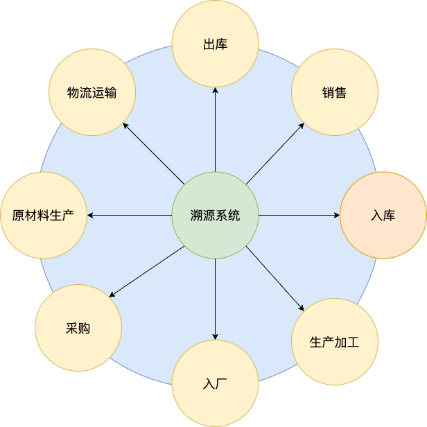
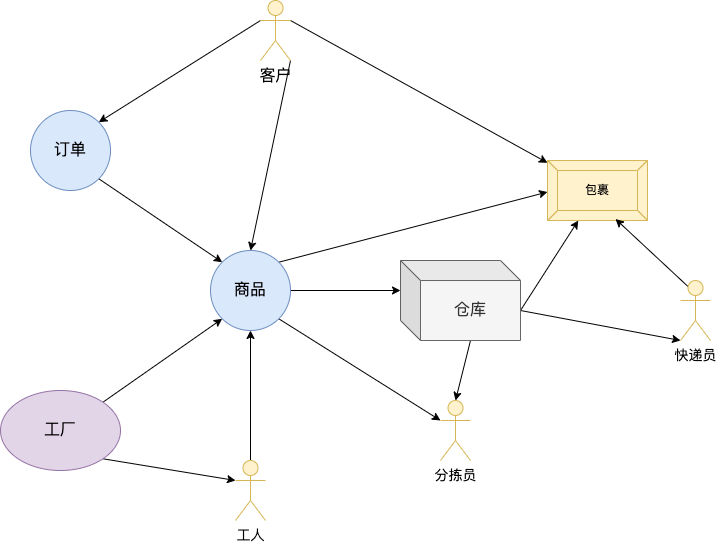
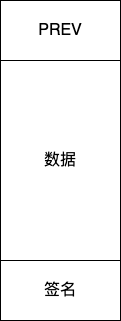
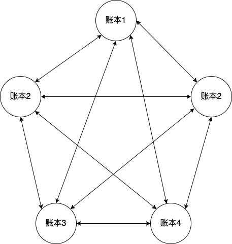
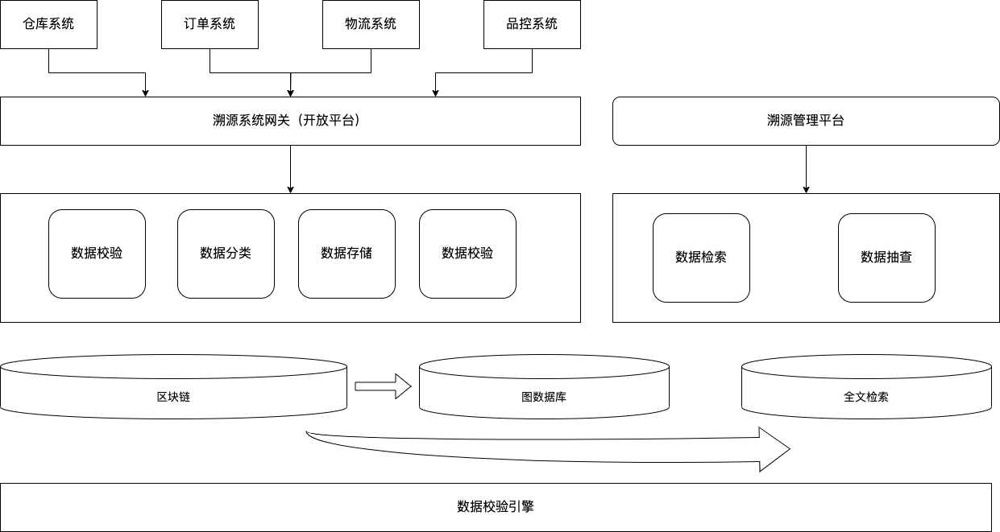

# 溯源系统

## 溯源系统作用环节

<figure><figcaption></figcaption></figure>

## 溯源系统中的实体和关系

<figure><figcaption></figcaption></figure>

## 溯源系统要点

### 数据采集

数据采集是指，产品全生命周期每个环节都需要上报系统，切每个实体身份唯一，不可修改

### 数据分类

产品生命周期环节众多，不同的流程，数据格式不一样，需要针对不同的流程对数据做分类处理

### 数据校验

各个环节有独立的规则，针对采集或者上报的数据，需要做校验，针对不合法的数据需要拒绝入系统，并报警

### 数据存储

#### 实体属性不可直接修改

所有实体数据，属性不能直接修改；比如用户商品库存不能修改，只能通过增加入库或者出库记录来间接修改

#### 数据不改篡改

数据入了系统，不能修改，不能删除

#### 数据不可丢失

数据需要备灾机制，不因不可抗力因素导致数据丢失

### 数据关联

需要从海量数据中，找到互相产生关系的数据，形成对应的组织关系

### 数据安全

#### 传输安全

&#x20;数据传输过程

传输过程数据加密，且有签名校验机制，防止被窃取和篡改

#### 存储安全

有严格的数据权限，数据查看不可越权，简单来说只能查看自己有权限的数据，其他数据不可查看

## 技术要点

### 区块链

<figure><figcaption></figcaption></figure>

#### 区块链和传统数据库的不同

1. 区块链上每个节点前后之间互相有联系，彼此相连形成一条链；传统数据库数据之前没有联系

<figure><figcaption></figcaption></figure>

PREV：记录的是上一个节点的信息

数据：需要记录的数据

签名：针对数据+PREV形成的校验数据，可以理解为公证系统开具的公证证明

通过以上机制，可以防止数据只能追加，不可篡改

2. 区块链是分布式的，每个账本（结点）都有一份完整的数据

<figure><figcaption></figcaption></figure>

分布式存储保证了数据不会丢失，一个账本（结点）丢失了还有其他账本（结点）可以恢复

3. 账本之间是有共识算法的，写入的数据都是经过共识认证的，是可信的

通过共识算法可以保证数据不可伪造

### 图数据库

<figure><figcaption></figcaption></figure>

图数据库是实现高效查询实体关系的基础

传统数据是以行为基础，其表现形式可以理解为表格

图数据库是以关系为基础，其表示形式可以理解为网

#### 全文检索

<figure><figcaption></figcaption></figure>

全文检索是实现高效搜索和模糊搜索的关键技术

全文检索关键技术

1. 分词；将一段文本拆分成多个词组
2. 泛化；常见的，比如错别字纠正，修饰词/语气词等不影响雨衣的词去除
3. 倒排索引；建立词语和文档的关系

## 溯源系统架构

<figure><figcaption></figcaption></figure>
