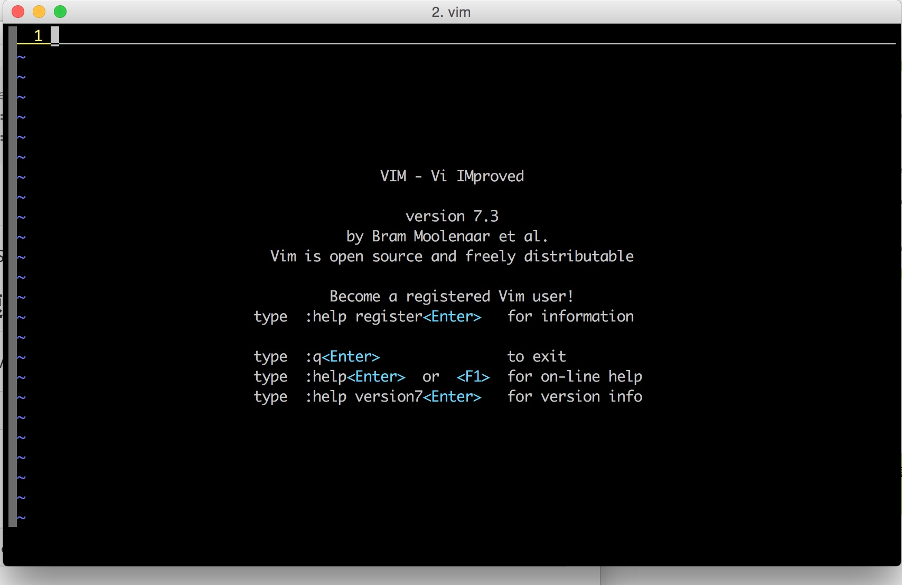
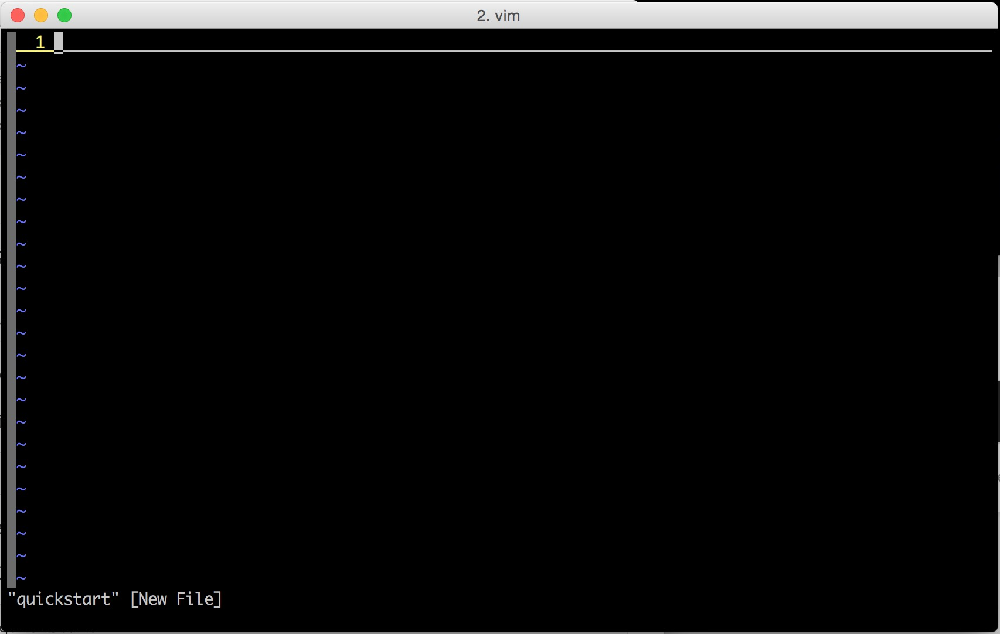
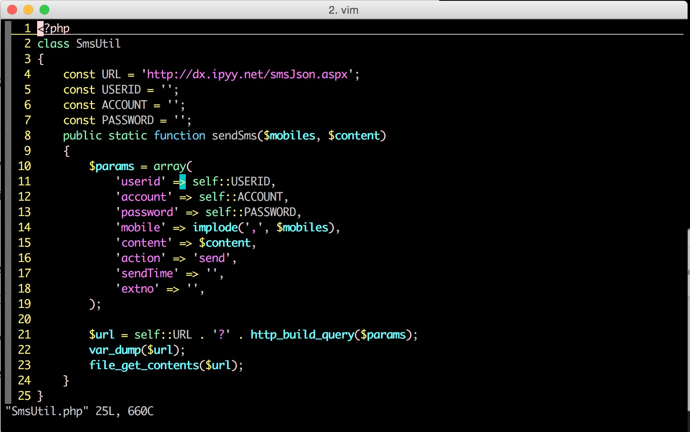
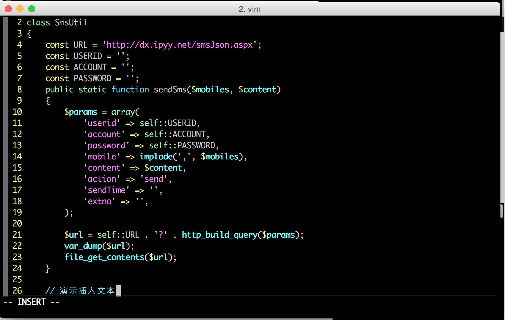
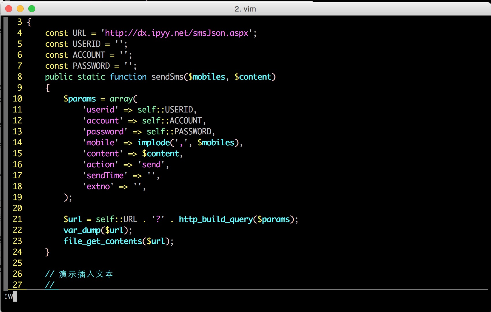
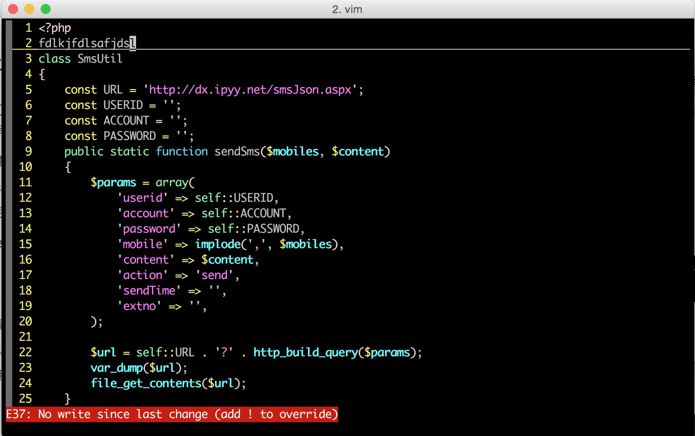

# Vim系列之初体验(二)

### Vim安装

Mac OS和Unix系统默认都有安装，所有Vim的安装不多介绍。

### 快速开始

**命令：vim \[文件名] 文件名可选**

直接输入vim

```bash
vim
```

效果如图：

<figure><figcaption></figcaption></figure>

**vim 文件名** 文件不存在将会自动创建。

```bash
vim quickstart
```

打开一个不存在的文件；效果如图：

<figure><figcaption></figcaption></figure>

打开一个已经存在的文件；效果如图：

<figure><figcaption></figcaption></figure>

_**此时，vim处于普通模式。**_

### 简单的移动

上一节，如果我们用vim打开的是一个已知文件的话，我们是可以上下左右移动光标的

1. 向左移动：字母h
2. 向下移动：字母j
3. 向上移动：字母k
4. 向右移动：字母l

<figure><figcaption></figcaption></figure>

插入文本

插入文本需要切换到**插入模式**，按hjkl将光标移动到需要插入文本处按字母i即可切换到插入模式，此时我们就可以输入我们需要插入的文本了。

<figure><figcaption></figcaption></figure>

输入完毕，按Esc键可以重新切换回到普通模式。

### 保存

在输入了一大串文本之后，最重要的就是要记得保存，想象一下，blablabla...输入了一大串之后忘记保存了。。。

保存需要在**命令行模式**下操作，在普通模式下按:(冒号)即可进入命令行模式。

在命令行模式下输入字母w即可保存，如果最初是直接输入vim命令进入vim的，可以输入字母w空格后面跟想要保存的文件名

<figure><figcaption></figcaption></figure>

### 退出

退出也需要在命令行模式下进行操作。

在命令行模式下输入字母q即可退出；如果文件有改动而我们又没有保存的话，vim会提示我们，如下图：

<figure><figcaption></figcaption></figure>

此时我们有两种选择

1. 保存之后再退出，先:w保存一下，然后再:q退出；或者直接:wq保存并退出
2. 放弃刚才的修改并退出:q!退出，字母q后面加上!(感叹号)
